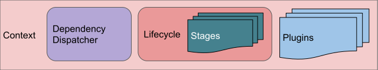
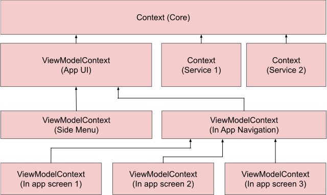
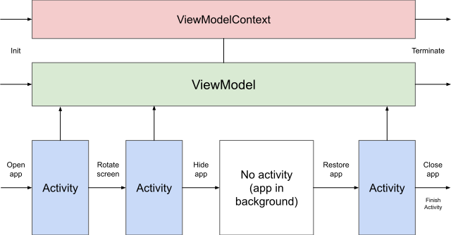

[Back to Manual](../manual.md)

___

## Architecture of apptronic.net/core

### Context

Base architecture brick is **Context**

**Context** is "responsibility area" like:
 - whole app
 - app UI
 - single app screen
 - repository
 - background service
 - etc.

**Context** contains:
 - <ins>Dependency Dispatcher</ins> is responsible for managing DI modules, instances and scopes.
 - <ins>Lifecycle</ins> is stack-based manager for <ins>Lifecycle Stages</ins>
 - <ins>Lifecycle Stage</ins> is "level" of current state of **Context**. Each <ins>Lifecycle</ins> creates with default Root Stage, and additional stages can be added while defining **Context**
 - <ins>Plugins</ins> can be used to add additional functionality to Framework without modifying its code. They used to add concrete platform integration and can add common features to the whole app for specific app project.
 
 **Context** itself does not contain any logic. To implement some logic it needed to create **Component** in concrete **Context**:

**Component** is "worker", who implements some logic and executes some code. Component works until it's **Context** is alive and automatically destroyed when **Context** is terminated.

 
 One **Context** can hold any number of **Component**s. In most cases one **Component** is "main", other **Component**s are additional components, which can be created to help main **Component** do it's work.
 
 For example, main **Component** is **ViewModel**, when additional **Component** in same **Context** is some kind of Repository.
 
 Commonly main **Component** knows in which **Context** it works and can manage its **Lifecycle** (if needed), when other **Component**s work with abstraction of **Context** and don't know anything about it.

 ### Context tree architecture
 
 For any application it needed to create one **Core Context**.
 
 Application architecture described as tree of **Context**s, where **Core Context** alive while application alive itself, other **Context**s can be created/destroyed during application lifecycle.
 

 Any **Context** except **Core** can be created as child of any another **Context** <ins>at runtime</ins>. Dependency parent-child works in next way:
  - child **Context** **Lifecycle** generally independent of parent **Context** Lifecycle
  - child **Context** **DependencyDispatcher** can inject anything from parent **Context** **DependencyDispatcher** recursively (up to **Core Context**)
  - each **Context** **DependencyDispatcher** can override any declaration, in that case all injections done in this **Context** and it's children will use overridden declaration
  - child **Context** automatically terminates when parent **Context** is terminated
  - each **Content** holds **Component**s which can interact one with another inside one **Context**
  - interaction between **Component**s which works in different **Content**s possible, but it needed to be explicitly defined (will be described later)

 ### Using ViewModels to implement application UI ViewModel layer
 
 App UI generally defined as single **ViewModel**, while holds all other **ViewModel**s inside.
 
 Root **ViewModel** created when it needed to show app UI (Activity created on Android) and terminated when app UI is hidden (Activity destroyed on Android).
 
 It is not required to destroy **ViewModel** when Activity is destroyed (for example, when app rotates and Activity will be recreated soon). In that case recreated Activity will bind to same instance of **ViewModel** and all view state will be restored from **ViewModel**. Same mechanism can be used on any platform.
 
 Example of how in works for **Android** platform:
 

As **ViewModelContext** and **ViewModel** commonly hold inside of **Core Context** (or another **Context**, which is child of **Core Context**), it is not depends directly from UI lifecycle (but depends when it explicitly specified by developer) and can be alive as long as needed. For **Android** apps **Core Context** commonly held inside **Application** object and alive all time while app process alive.

It is only <ins>example</ins> interaction. Developer can control interaction as it needed for concrete app project and implement another interaction flow.

___

[Back to Manual](../manual.md)

Next topic: [Lifecycle](lifecycle.md)