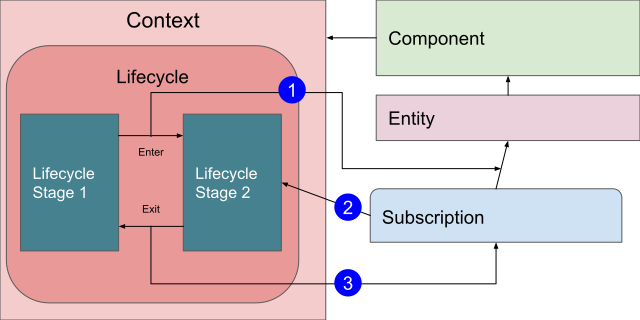
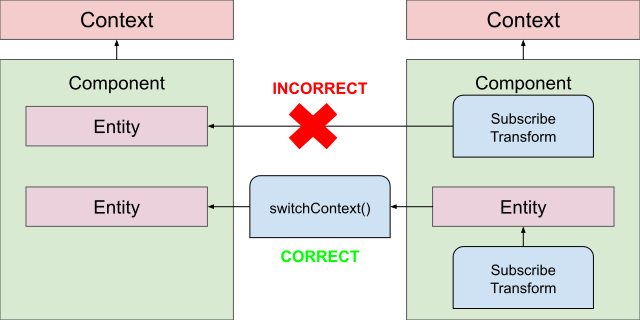

[Back to Manual](../manual.md)

Previous topic: [Implementation of Components: threading(coroutines)](threading.md)
___

## Implementation of Components: reactive behavior

**apptronic.net/core** framework contains integrated reactive library.

### Base architecture

The main brick or reactive is ```Entity```
```kotlin
interface Entity<T> : Observable<T> {

    val context: Context

    override fun subscribe(observer: Observer<T>): EntitySubscription {
        return subscribe(context, observer)
    }

    fun subscribe(targetContext: Context, observer: Observer<T>): EntitySubscription

}
```
Entity is ```Observable``` which is bound to ```Context``` and automatically works with it's ```Lifecycle```.

This is main difference from classical ```Observable``` is that it contains reference to the ```Context``` in which it was created and each subscription, created by invocation of ```subscribe()``` method, automatically bounds to current active ```LifecycleStage``` of it's ```Context``` (not when ```Entity``` created, but when ```subscribe()```), being automatically cancelled when ```LifecycleStage``` is exited.



1. Lifecycle Stage entering triggers create subscription by calling ```Entity.subscribe()``` method.
2. ```Entity``` creates subscription and automatically registers it in currently active ```LifecycleStage```.
3. When specified ```LifecycleStage``` exiting - ```EntitySubscription.unsubscribe()``` called automatically.

### Working with different Contexts

Each ```Entity``` always bound to concrete ```Context```. It means that all ```subscribe()``` calls will register subscription in ```Lifecycle``` of that ```Context```.

But in many cases it needed to create subscription from some another place, which is working in another ```Context```.

For that case there is second variant for subscribe:
```kotlin
fun subscribe(targetContext: Context, observer: Observer<T>): EntitySubscription
```
Mechanics of that differs from call without context specification:
* In case if parameter ```context``` same as ```Entity``` own ```context``` the subscription management will work in same way.
* In case if parameter ```context``` differs from ```Entity``` own ```context``` the subscription will be registered in both ```Context```, but with some differences:
    * in **source** ```Context```, which is ```Entity``` own ```Context```, it registered not it active ```LifecycleStage```, but in root ```LifecycleStage```, meaning automatic unsubscribe will be triggered only when **source** ```Context``` is terminated.
    * in **target** ```Context```, which is provided as parameter ```context: Context``` to ```subscribe``` method, it registered it's active ```LifecycleStage``` and will be automatically unsubscribed when currently active ```LifecycleStage``` of **target** ```Context``` exits.

<ins>This is very important to keep in mind this when using ```Entity``` not inside of same component, but provided externally from any other place.</ins>

### Switching Entity context

Not always it needed to use ```subscribe()```, sometimes ```Entity``` used as source for transformations. In that case, instead of using
```kotlin
fun subscribe(targetContext: Context, observer: Observer<T>): EntitySubscription
```
it needed to use
```kotlin
fun <T> Entity<T>.switchContext(targetContext: Context): Entity<T>
```
This function creates new ```Entity``` in ```targetContext```, which reflects all changes from source ```Entity``` and allows use it in ```targetContext```.

For example:

```kotlin
interface SomeRepository {

    fun someData(target: Context) : Entity<SomeDataType>

}

class SomeRepositoryImpl(context: Context) : BaseComponent(context) {

    private val someDataSource: Entity<SomeDataType> // some implementation

    override fun someData(target: Context) : Entity<SomeDataType> {
        return someDataSource.switchContext(target)
    }

}

class ClientComponent(context: Context) : BaseComponent(context) {

    val someRepository = inject<SomeRepository>()

    val someDataRepresentation = someRepository.someData(context).map {
        // implement mapping function
    }   

}
```

The example above shows correct usage of ```Entity``` which needed to be transferred between different **Components**.

As each **Context** is <ins>isolated</ins> responsibility zone, transferring reactive streams between any **Contexts** requires creation of *bridge* between this **Contexts**. Function ```switchContext(targetContext: Context)``` creates that bridge using ```subscribe(context: Context)``` internally on source ```Entity```.

As injection or another way of providing of any external object means no knowledge of its scope and **Context** interface which provides any function which returns ```Entity``` or it's sub-type should require ```Context``` as parameter and call ```switchContext(targetContext: Context)``` in its implementation.



Ignoring this rule may cause unexpected behavior of automatic subscription management, as any actions, performed with ```Entity``` from another **Context**, returned without calling ```switchContext(targetContext: Context)```, will be bound to its own **Context**, depending on its **Lifecycle**, active **LifecycleStage** at the moment of any subscribe/transform call and will not know anything about target **Context**.

One more thing is that any transformation function which uses several **Entities** as its source will fail with runtime Exception as it uses source **Entities** **Context** as its own **Context**. If source **Entities** have different **Contexts** it cannot define which **Context** to use. But when all sources uses same **Context** it will work normally, independently of this **Entities** created in this **Context** or bridget to this **Context** using ```Entity.switchContext(targetContext: Context)``` call.

### Declaring Entity

Tho main **Entity** types is:
 - property (store value inside and send it to new subscribers and resend updates to all subscribers)
 - value - property, which value can be set by developer
 - event (do not store value, only resend updates to all subscribers)

```kotlin
class Component(context: Context) : BaseComponent(context) {

    val someValue1: Value<String> = value<String>() // value of type [String]
    val someValue2: Value<String> = value<String>("Default value") // value of type [String] with initial value
    val someProperty1: Property<String> = property(someValue1) // property, which uses [someValue1] as source 
    val someProperty2: Property<String>  = property(
        merge(someValue, someValue2) { v1, v2 -> "$v1 $v2" }
    ) // property, which uses result of merging of [someValue] and [someValue2] as source
    val someProperty3: Property<String> = property(someValue1, "Default") // property, which uses [someValue1] as source and emits "Default" until [someValue1] not set
    val someProperty4: Property<String> = property("Will never change") // property, which store "Will never change" and cannot be changed
    val onEvent: Event<Unit> = genericEvent() // untyped event, extends Entity<Unit>
    val onTypedEvent: Event<Int> = typedEvent<Int>() // event with type specification, extends [Entity<T>]

}
```

* ```Property<T>``` is sub-type of ```Entity<T>```, which stores current value.
    * value can be retrieved by calling ```get()```
    * ```subscribe()``` call will emit stored value immediately, and then each updated value
* ```Value<T>``` is sub-type of ```Property<T>```, which stores current value and can be directly set
    * value can be retrieved by calling ```get()```
    * value can be set by calling ```set(value: T)```
    * ```subscribe()``` call will emit stored value immediately, and then each updated value
* ```Event<T>``` is sub-type of ```Entity<T>```, which not stores any value
    * event can be sent by calling ```update(T)```
        * event of type ```Unit``` can be sent by calling ```sendEvent()``` when created as ```genericEvent()```
        * event can be sent by calling ```sendEvent(event: T)``` when created as ```typedEvent<T>()```
    * ```subscribe()``` call will not emit anything immediately, but will emit each updated value

### Entity transformation functions

Many of transformation functions support synchronous and asynchronous mode.

In the synchronous mode all transformations invoked in same execution window in thread in which source ```Entity``` updated.

In the asynchronous mode Kotlin Coroutine launched to invoke transformations and result of Coroutine set to result ```Entity```. It emit result is same thread, but transformation can be performed in another thread using ```CoroutineContext``` or ```CoroutineDispather```. For this transformation functions added ```async``` suffix.

This approach designed because of 2 reasons:
 - performance: as many transformations is very simple launching Coroutine and switching thread may be more CPU-consuming that transformation itself, so basic transformation are better to perform synchronously
 - debugging: synchronous transformation can be easily debugged and in case or any exceptions full stack trace up to initial ```Entity``` update invocation code.

#### Mapping

```kotlin
fun <T, R> Entity<T>.map(map: (T) -> R): Entity<R>
fun <T, R> Entity<T>.mapSuspend(map: suspend CoroutineScope.(T) -> R): Entity<R>
```

When called on ```Entity<T>``` return ```Entity<R>```, which subscribed to ```Entity<T>``` and each time, when ```Entity<T>``` emits value ot type ```T``` it will emit value of type ```R``` which is result of transformation ```map: (T) -> R```.

```kotlin
    val stringValue: Entity<String> = value<String>()
    val stringLength: Entity<Int> = stringValue.map { it.length }
    val stringLengthAsync: Entity<Int> = stringValue.mapSuspend {
        withContext(Dispatcher.IO) { 
            it.length 
        }
    }
```

#### Filtering

```kotlin
fun <T> Entity<T>.filter(filterFunction: (T) -> Boolean): Entity<T>
fun <T> Entity<T>.filterSuspend(filterFunction: suspend CoroutineScope.(T) -> Boolean): Entity<T>
fun <T> Entity<T?>.filterNotNull(): Entity<T>
fun <T> Entity<T>.filterNot(filterNotFunction: (T) -> Boolean): Entity<T>
fun <T> Entity<T>.filterNotSuspend(filterNotFunction: (T) -> Boolean): Entity<T>
```
When called on ```Entity<T>``` return ```Entity<T>```, which subscribed to source ```Entity<T>``` and re-emits only when it matches:
    - ```filterFunction``` returns ```true``` for ```filter``` and ```filterSuspend```
    - ```filterNotFunction``` returns ```false``` for ```filterNot``` and ```filterNotSuspend```
    - source is not null for ```filterNotNull()```

```kotlin
    val intValue: Entity<Int> = value<Int>()
    val onlyPositive: Entity<Int> = intValue.filter { it >= 0 }
    val onlyPositiveAsync: Entity<Int> = intValue.filterSuspend {
        withContext(Dispatcher.IO) { 
            it >= 0 
        }
    }

    val stringValue: Entity<String?> = value<String?>()
    val stringNotNull: Entity<String> = stringValue.filterNotNull()
```

#### Combining Entities: functions

```kotlin
// single source function (equals to mapping)
fun <T, A> entityFunction(source: Entity<A>, method: (A) -> T): EntityFunction<T>
fun <T, A> entityFunctionSuspend(source: Entity<A>, method: suspend CoroutineScope.(A) -> T): EntityFunction<T>

// array source function
fun <T> entityArrayFunction(source: Array<Entity<*>>, method: (Array<Any?>) -> T): EntityFunction<T>
fun <T> entityArrayFunctionSuspend(source: Array<Entity<*>>, method: suspend CoroutineScope.(Array<Any?>) -> T): EntityFunction<T>

// two sources function
fun <T, A, B> entityFunction(
        left: Entity<A>, right: Entity<B>,
        method: (A, B) -> T
): EntityFunction<T>
fun <T, A, B> entityFunctionSuspend(
    left: Entity<A>, right: Entity<B>,
    method: suspend CoroutineScope.(A, B) -> T
): EntityFunction<T>

// more sources functions (3..5)
fun <T, A, B, C/*, D, E*/> entityFunction(
        a: Entity<A>,
        b: Entity<B>,
        c: Entity<C>,
        //d: Entity<C>,
        //e: Entity<C>,
        method: (A, B, C, /*D, E*/) -> T
): EntityFunction<T>
fun <T, A, B, C/*, D, E*/> entityFunctionSuspend(
        a: Entity<A>,
        b: Entity<B>,
        c: Entity<C>,
        //d: Entity<D>,
        //e: Entity<E>,
        method: suspend CoroutineScope.(A, B, C, /*D, E*/) -> T
): EntityFunction<T>
```
What ```EntityFunction``` does:
 - stores latest values from each source internally
 - executes ```method``` on set of latest values from each source ony time when any source ```Entity``` emits new value
 - don't execute anything until all sources emitted any value
 - stores result of ```method``` execution and emits immediately for each new subscriber
 - emits any next result of ```method``` execution to all subscribers

```EntityFunction``` stores last calculation result so on subscription it works similar to ```Property```.

If any of sources is ```Event``` it will internally cache latest emitted value, but not retrieve any value, emitted before ```EntityFunction``` created.

All sources should be from same ```Context```, in other case it throws ```IllegalArgumentException```.

#### Combining entities: merging

Generally using ```entityFunction()``` or ```entityFunctionSuspend()``` directly not needed.

Instead of that use predefined ```megre()``` extensions:
```kotlin
// merge can have from 2 to 5 arguments of types: A, B, C, D, E
fun <R, A, B> merge(
        a: Entity<A>, b: Entity<B>,
        method: (A, B) -> R
): EntityFunction<R>
fun <R, A, B> mergeSuspend(
        a: Entity<A>, b: Entity<B>,
        method: suspend CoroutineScope.(A, B) -> R
): EntityFunction<R>

// merging can be performed on any size array
fun <R, T> mergeArray(
        vararg array: Entity<out T>,
        method: (List<T>) -> R
): EntityFunction<R>
fun <R, T> mergeArraySuspend(
        vararg array: Entity<out T>,
        method: suspend CoroutineScope.(List<T>) -> R
): EntityFunction<R>

// calling merge on first source works in same way as putting it as first argument to [merge]
// up to 4 arguments of types B, C, D, E
fun <R, A, B> Entity<A>.mergeWith(
        b: Entity<B>,
        method: (A, B) -> R
): EntityFunction<R>
fun <R, A, B> Entity<A>.mergeSuspendWith(
        b: Entity<B>,
        method: suspend CoroutineScope.(A, B) -> R
): EntityFunction<R>

// merging can be performed without merge functions
// in that case it returns simple combination of sources
class MergeTwoResult<A, B>(val first: A, val second: B)
class MergeThreeResult<A, B, C>(val first: A, val second: B, val third: C)
class MergeFourResult<A, B, C, D>(val first: A, val second: B, val third: C, val fourth: D)
class MergeFiveResult<A, B, C, D, E>(val first: A, val second: B, val third: C, val fourth: D, val fifth: E)
// from 2 to 5 arguments of types A, B, C, D, E
fun <A, B> merge(
        a: Entity<A>,
        b: Entity<B>
): EntityFunction<MergeTwoResult<A, B>>
// merging any size array
fun <T> mergeArray(
        vararg array: Entity<out T>
): EntityFunction<List<T>>
// merging with, up to 4 arguments of types B, C, D, E
fun <A, B> Entity<A>.mergeWith(
        b: Entity<B>
): EntityFunction<MergeTwoResult<A, B>>

// merging single entity with array of other sources
class MergeArrayResult<S, T>(val value: S, val list: List<T>)
fun <S, T> Entity<S>.mergeWithArray(
        vararg array: Entity<out T>
): EntityFunction<MergeArrayResult<S, T>>
```

Merge functions combines sources and emits result or merging.

#### Combining entities: other functions

There is a big amount or predefined functions. It can be found in source code of next files:
```kotlin
BooleanFunctions.kt
ChooserFunctions.kt
CollectionExtensions.kt
CombineFunctions.kt
EntityFunction.kt
GenericFunctions.kt
NumericFunctions.kt
NumericFunctionsExt.kt
StringFunctions.kt
```

Some examples of them:
```kotlin
    val bool1: Entity<Boolean> = value<Boolean>()
    val bool2: Entity<Boolean> = value<Boolean>()
    val boolAnd: Entity<Boolean> = bool1 and bool2
    val boolOr: Entity<Boolean> = bool1 or bool2

    val str: Entity<String> = value<String>()
    val isEmpty: Entity<Boolean> = str.isEmpty()

    val list: Entity<List<String>> = value<List<String>>()
    val listSizes: Entity<List<Int>> = list.mapItems { it: String -> it.length }
    val notEmptyList: Entity<List<String>> = list.filterItems { it: String -> it.isNotEmpty() }
```

#### Function result is a Property or is an Event?

As mentioned before ```EntityFunction``` stores last value, meaning it always works as ```Property```.

To transform it to eventual entity, which not stores value, use
```kotlin
fun <T> Entity<T>.asEvent(): Entity<T>
```
Or another case is create define explicitly result of each function:
```kotlin
val source1 = value<Boolean>()
val source2 = typedEvent<Boolean>()
    
val property: Property<Boolean> = property(source1 and source2)
val event: Event<Boolean> = event(source1 and source2)
```

#### Using property from function builder method

Recommended way to create ```Property``` using custom function:

```kotlin
fun <T, A> Component.functionOf(
        a: Entity<A>,
        functionOf: (A) -> T
): Property<T>

fun <T, A, B> Component.functionOf(
        a: Entity<A>, b: Entity<B>,
        functionOf: (A, B) -> T
): Property<T>

fun <T, A, B, C> Component.functionOf(
        a: Entity<A>, b: Entity<B>, c: Entity<C>,
        functionOf: (A, B, C) -> T
): Property<T>

fun <T, A, B, C, D> Component.functionOf(
        a: Entity<A>, b: Entity<B>, c: Entity<C>, d: Entity<D>,
        functionOf: (A, B, C, D) -> T
): Property<T>

fun <T, A, B, C, D, E> Component.functionOf(
        a: Entity<A>, b: Entity<B>, c: Entity<C>, d: Entity<D>, e: Entity<E>,
        functionOf: (A, B, C, D, E) -> T
): Property<T>

fun <T> Component.functionOf(
        array: Array<Entity<*>>,
        functionOf: (Array<Any?>) -> T
): Property<T>
```

For example:

```kotlin
val source1 = value<Boolean>()
val source2 = typedEvent<Boolean>()
    
val text: Property<String> = functionOf(source1) { it: Boolean ->
    "The value of source1 is $it"
}
val equalityText: Property<Boolean> =  functionOf(source1, source2) { s1, s2: Boolean ->
    val message = if (s1 == s2) "equals" else "not equals"
    "The value of source1 is $message to source2"
}
```

___

[Back to Manual](../manual.md)

Next topic: [App UI implementation with ViewModels](view_models.md)