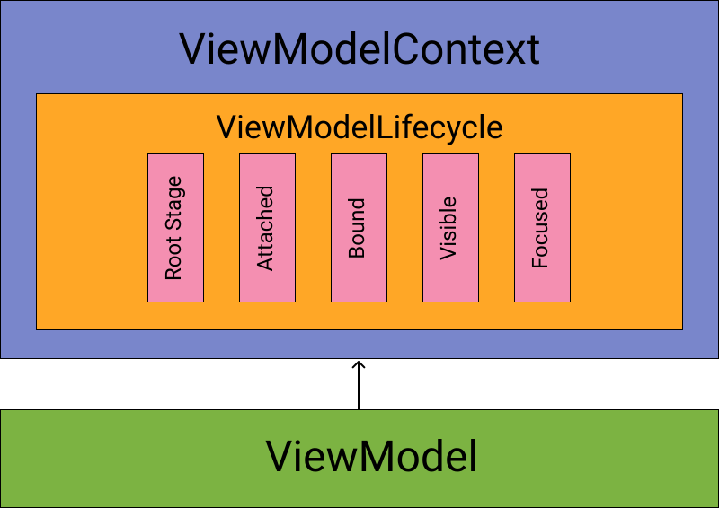
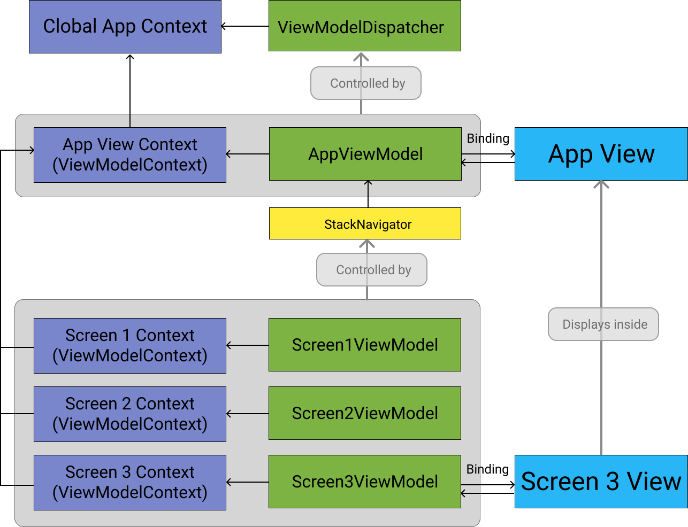

[Back to Manual](../manual.md)

Previous topic: [Implementation of Components: reactive behavior](reactive_behavior.md)

___

## App UI implementation with ViewModels

The **apptronic.net/core** framework designed to build application UI logic in common code using MVVM design pattern.
 
Base class for UI logic implementation is **ViewModel**. As **ViewModel** subclass of **Component** all features of **Component** will work in **ViewModel**: using of dependency injection, coroutines integration and **Lifecycle**.

### Philosophy

For creating complex user interfaces it commonly created many **View**s with its **ViewModel**s, and **View** layer implementing logic when to create concrete **View** and initialize **ViewModel** for it. This approach mixes rendering and navigation, which violates Single responsibility principle.

The **apptronic.net/core** framework introduces new philosophy of building user interfaces: inversion of control from **View** owns **ViewModel** to **ViewModel** controls **View**.

According to this whole application UI should be managed by a single root **ViewModel**, when **View** only displays state and changes of this **ViewModel** and statically bound to it.

For creating complex user interfaces the root **ViewModel** of app UI creates "branches" which can contain other **ViewModel**s, allowing creating a **ViewModel** tree. Any **ViewModel** can contain and manage any number of child **ViewModel**s.

After that the **View** layer should be able to render each type of **ViewModel** in app and provide view containers for inner **ViewModel**s. This logic completely releases **View** layer from knowledge when and how user interface should change, including navigation and routing. Only the **ViewModel** layer can decide what should be displayed on screen, when **View** layer simply displays **ViewModel** state and changes.

### Architecture

The main feature that **ViewModel** works with **ViewModelContext** with predefined **Lifecycle**.

1. <ins>Root</ins> stage is default for any **Context**/**Lifecycle**.
2. <ins>Attached</ins> stage: **ViewModel** is placed into container which is responsible for managing it.
3. <ins>Bound</ins> stage: some **View** is now observing state of **ViewModel** and can be displayed.
4. <ins>Visible</ins> stage: user can see bound **View** on his screen.
5. <ins>Focused</ins> stage: user can interact with bound **View**.

Inside if **ViewModel** it possible to enable some functionality when **ViewModel** entered into specific stage, as inject some dependencies only for specific stage.

**ViewModel** can be attached by:
- **ViewModelDispatcher** is responsible for handling root UI **ViewModel** which responsible for standalone user interface part. It can be whole UI (for example, single Activity Android app) or UI divided into multiple windows in system.
- **Navigator** handles some number of **ViewModel**s and allows control which **ViewModel**s should be rendered now on user interface.

1. The global app **Context**, which is exists until app process exists.
2. **ViewModelDispatcher** inside the global app **Context**.
3. App View **Context** is **ViewModelContext** and child of global app **Context**. It is controlled by **ViewModelDispatcher**.
4. <em>AppViewModel</em> is responsible for while application UI. <em>App View</em> bound to it which is displaying on screen.
5. **StackNavigator** inside <em>AppViewModel</em> manages app screens (**ViewModel**s with each **ViewModelContext**). This concrete navigator requests displaying only last **ViewModel** in stack.
6. <em>Screen1ViewModel</em>, <em>Screen2ViewModel</em> and <em>Screen3ViewModel</em> with their **ViewModelContext**s is responsible for different app screens.
7. <em>Screen 3 View</em> is bound to <em>Screen3ViewModel</em>. <em>Screen 3 View</em> displayed inside <em>App View</em>.

### ViewModelDispatcher

**ViewModelDispatcher** is a **Component** which dispatches creating and terminating **ViewModel**. It can create new **ViewModel** or return currently existing one to requestor when needed (usually it is the **View** layer when it appears on screen to be rendered). Also it can hold instance of **ViewModel** when View layer destroyed, saving **View** state.

**ViewModelDispatcher** should be created inside of UI-independent **Component** (for example, in root app **Component**). **View** layer will request **ViewModel** to binding and **ViewModelDispatcher** returns existing **ViewModel** or creates new one of it is not exists. By request **ViewModelDispatcher** destroys currently held **ViewModel**: it can be done when user closes app UI. Alternatively **ViewModelDispatcher** can retain **ViewModel** instance to restore UI state after user open app again. 

### Navigator

**Navigator** can manage many **ViewModel**s at same time, and depending on type of **Navigator** it can send for rendering one or multiple **ViewModel**s. Any **Navigator** state completely controlled from developer side, allowing implementation of any logic of showing **ViewModel**s.

**Navigator** can be created only inside of **ViewModel**, and can hold any number of inner **ViewModel**s. Also, any **ViewModel** can hold inside any number of **Navigator**s of any type. This allows creating of complex user interfaces which completely controlled by **ViewModel** layer. When **View** binds to **ViewModel**, it binds each **Navigator** to render it inside some view container, and this container will render that **ViewModel**s which **Navigator** provides for it.

##### StackNavigator

Type of **Navigator** which sends only single **ViewModel** to be displayed on screen with corresponding **View**.

It always sends last **ViewModel** in a stack to be displayed, the stack itself is completely controlled by the developer: it possible to add, replace, remove any **ViewModel**, clear stack, reset stack to single **ViewModel** or replace whole stack with another stack.

##### ListNavigator

Type of **Navigator** which can display any number of **ViewModel**s at time. **View** layer requests from **ListNavigator** **ViewModel**s for rendering according to it's state (position of scroll in list or grid, page displayed inside of paging view container).

Developer controls content of **ListNavigator**, but **View** decides which of them should be displayed. It possible to request from **View** layer what to display by additional properties or evends of **ViewModel** which holds **ListNavigator**.

##### ListDynamicNavigator

Type of **Navigator** which from **View** perspective is same, but **ViewModel**s is generated dynamically based on list of some objects.

This can be objects on same type (to generate same-type **ViewModel**s) or different types (to generate different-type **ViewModel**s). This allows implementation of large dynamic lists which rows can contain different data and view.

### Implementation UI for concrete ViewModel

Generally it is pure **MVVM** and there is no major differences.

As for any **Component** any **ViewModel** can contain properties, events, methods etc. **View** layer binds to the concrete **ViewModel** and observes its state to display it on screen. Also, user interactions can be send to **ViewModel** as events, method calls or by updating **ViewModel** properties.

Any **Navigator** is also a property of **ViewModel**. Using corresponding binding from view container to **Navigator** for each **ViewModel** a corresponding **View** will be created and displayed inside of that view container.

### Conclusion

This architecture introduces full control of user interface state, logic and navigation from **ViewModel** layer, leaving times when routing or navigation implemented on **View** layer behind.

**View** only renders state of concrete **ViewModel**. As **Navigator** holds inner **ViewModel**s it also renders state of **Navigator** inside of specific view container, when each **ViewModel** provided by **Navigator** for rendering has its own corresponding **View**, which responsible to display its state on screen.

___

[Back to Manual](../manual.md)

Next topic: [Using Dependency Injection](dependency_injection.md)